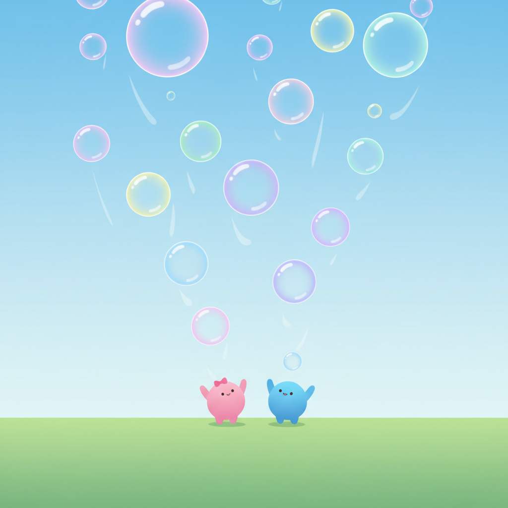

# בועות! (Bubbles!)

A cooperative 2-player bubble-catching game for kids.



## About

A fun, colorful game where two players work together to catch falling bubbles. Built with love for לוטם (7) and תום (4.5).

## How to Play

### Controls

| Player | Keys |
|--------|------|
| Player 1 | `A` / `D` |
| Player 2 | `←` / `→` |

### Objective

Catch as many bubbles as you can before time runs out! Both players share a single score - teamwork makes the dream work!

### Game Options

- **Player names** - Editable, saved between sessions
- **Player colors** - Pick from 8 pastel colors each
- **Game mode** - Day or Night
- **Timer** - 30, 45, or 60 seconds

## Running the Game

Run the Vite dev server for local development:

```bash
# Start the dev server
bun run dev

# Build for production
bun run build

# Preview the production build
bun run preview
```

## Project Structure

```
bubbles/
├── index.html          # Vite entry HTML
├── src/
│   ├── main.js         # PixiJS + game bootstrap
│   ├── game.js         # Game engine & logic
│   └── styles.css      # UI styling
├── design/
│   └── draft-v1.png    # Visual mockup
└── docs/
    └── GAME_PLAN.md    # Full game specification
```

## Features

- Hebrew RTL interface
- Customizable player names and colors (persistent)
- Day/Night game modes
- Persistent high scores (localStorage)
- Dreamy animated background with clouds and stars
- Cute kawaii blob characters
- Sparkle effects on bubble catch
- Playful, child-friendly UI
- Single-file bundle for easy sharing

## Tech Stack

- Vite for dev/build tooling
- PixiJS for rendering pipeline (canvas-backed)
- Vanilla HTML5, CSS3, JavaScript (ES6+)

## License

MIT
